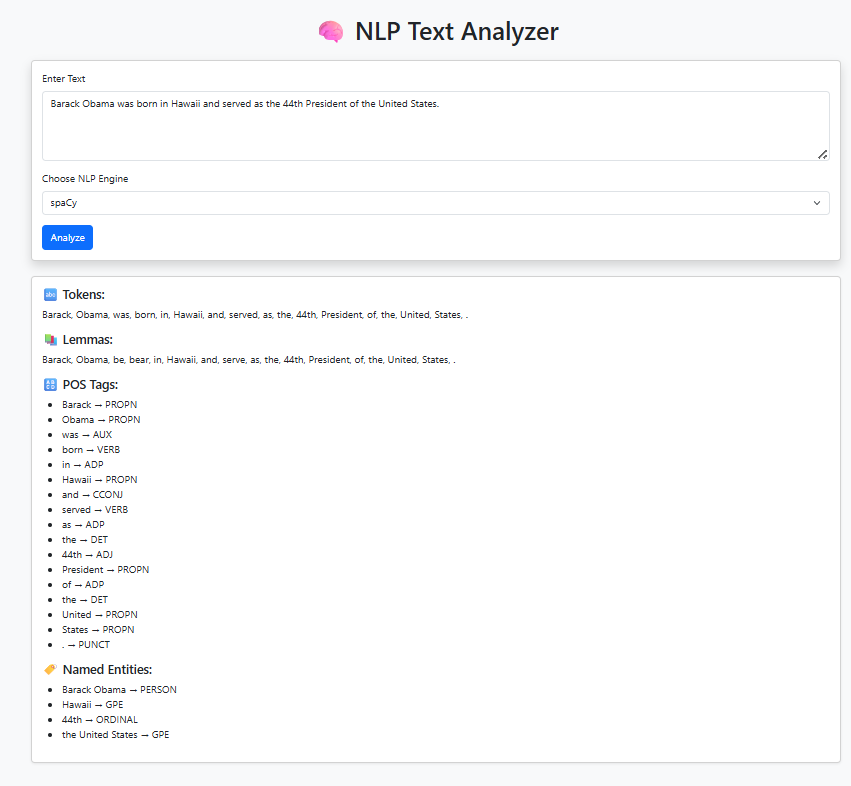
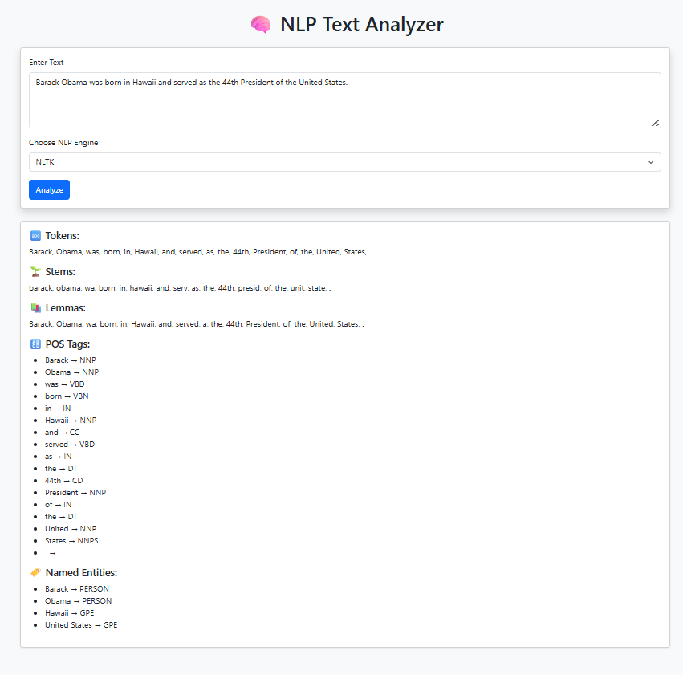
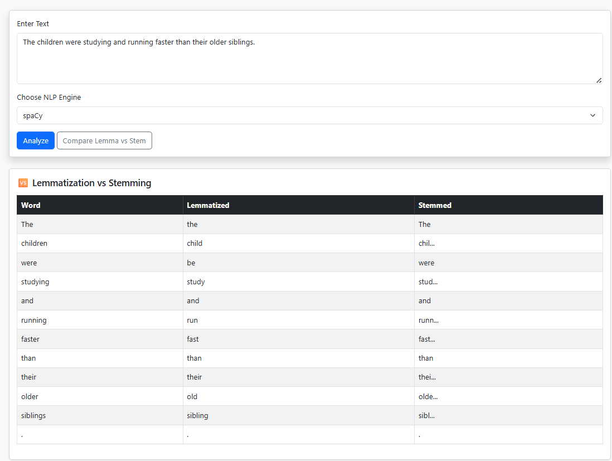

# 🧠 NLP Text Preprocessing API & Web App

A simple yet powerful **Flask-based REST API** and **interactive web app** that performs core **Natural Language Processing (NLP)** tasks including:

- Tokenization
- Lemmatization
- Stemming (NLTK only)
- Part-of-Speech (POS) Tagging
- Named Entity Recognition (NER)

Supports both **spaCy** and **NLTK** engines for processing.

---

## 🚀 Features

✅ REST API endpoint to process text using spaCy or NLTK  
✅ Interactive web UI using Bootstrap  
✅ Displays detailed NLP output cleanly  
✅ Dynamically adjusts output depending on selected engine  
✅ Lightweight and beginner-friendly

---
## 🏗️ Project Structure

assignment_1/assignment_1.1
│
├── main.py # Flask application
├── processor/
│ ├── init.py
│ ├── spacy_processor.py # spaCy NLP engine
│ └── nltk_processor.py # NLTK NLP engine
├── templates/
│ └── index.html # Web UI
├── static/
│ └── style.css # Optional styles
└── README.md
---
## 🛠️ Setup Instructions

### 1. Clone the repo

```bash
git clone https://github.com/shlokkoirala/LLM_basics.git
cd LLM_basics
cd assignment_1
cd assignment_1.1
```
### 2. Create Virtual Env
```
python -m venv venv
source venv/bin/activate  # On Windows: venv\Scripts\activate
pip install flask nltk spacy
```
### 3. Download NLTK & spaCy resources
```# Run in a Python shell
import nltk
nltk.download('punkt')
nltk.download('wordnet')
nltk.download('averaged_perceptron_tagger')
nltk.download('maxent_ne_chunker')
nltk.download('words')
nltk.download('omw-1.4')

# Download spaCy model
python -m spacy download en_core_web_sm

```
### 4. Run the App
```
python main.py
```
---

## 🖼️ Demo UI
### Using Spacy


### Using NLTK


---

# Lemmatization vs Stemming

Lemmatization and stemming are both techniques used in text normalization, i.e., reducing words to their root or base form. However, they differ in accuracy, rules, and output.

## Key Differences

| **Feature**           | **Stemming**                                      | **Lemmatization**                                |
|-----------------------|---------------------------------------------------|--------------------------------------------------|
| **Output**            | Root form (not always a valid word)              | Base/dictionary form (valid word)               |
| **Logic**             | Rule-based chopping                              | Uses vocabulary and morphological analysis      |
| **Speed**             | Fast                                              | Slower (more accurate)                          |
| **Accuracy**          | Less accurate                                     | More accurate                                   |
| **Context awareness** | No                                                | Yes                                             |
| **POS consideration** | No                                                | Yes                                             |
| **Tools**             | Porter, Snowball stemmers (NLTK)                 | WordNetLemmatizer (NLTK), spaCy                 |
| **Language dependent**| Mostly English                                   | Supports multiple languages (if trained)        |

### Example Differences using Spacy


**Note:** To see with NLTK try it out by setting up the repo

---

# Author
Made with ❤️ by  **Shlok Koirala**