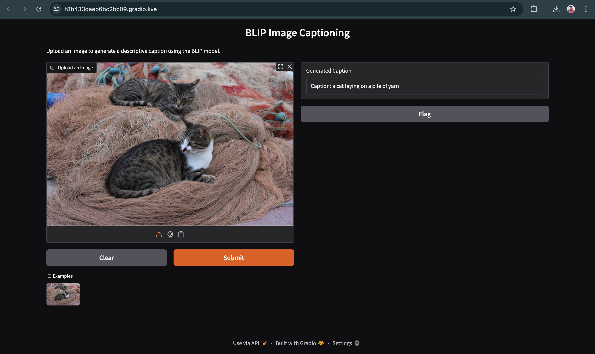
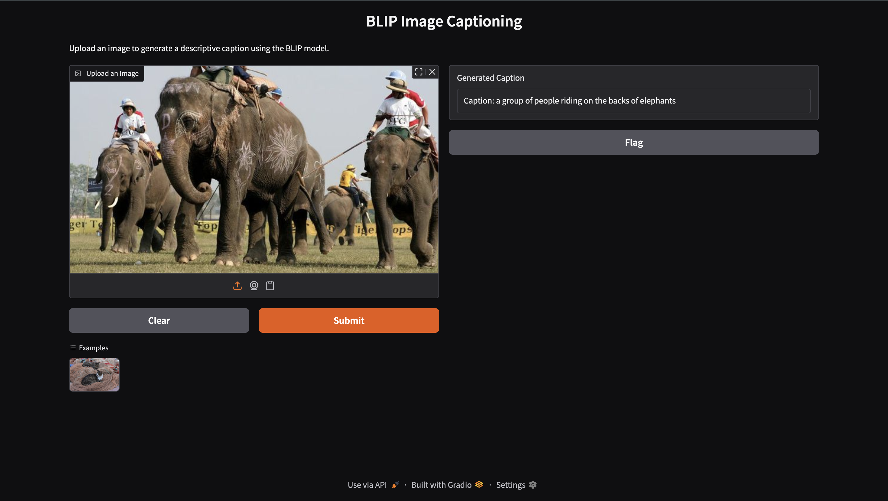

# BLIP Image Captioning Web App

This is a simple web application that generates natural language captions for images using the pretrained **BLIP base model** (`Salesforce/blip-image-captioning-base`) from Salesforce.

The app is built with [Gradio](https://gradio.app/) to provide an easy-to-use web interface where users can upload images and get descriptive captions instantly.

---

## Features

- Upload any image to receive a descriptive caption.
- Powered by the state-of-the-art BLIP base model fine-tuned for image captioning.
- Runs seamlessly on CPU or GPU.
- Minimalistic and user-friendly UI using Gradio.

---

## Demo
*Caption generated for huggingface.co/dataset ie cat.png*
  


*Caption generated for Elephant Polo Game.*
  


---

## Installation

1. Clone this repository:
   ```bash
   git clone https://github.com/navin123456789/BLIP_Simple_Demo.git
   cd BLIP_Simple_Demo

